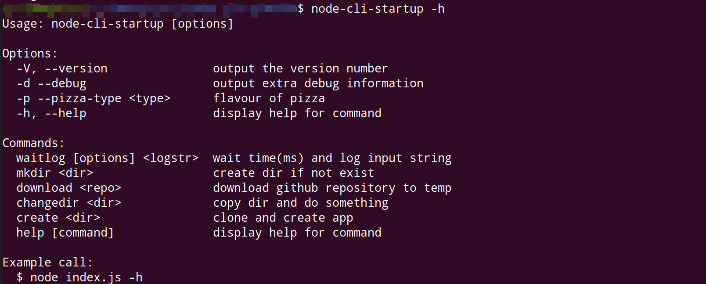

# node-cli-startup


一个脚手架命令行起步，可以实现下载模板生成项目的功能。

## 演示




## TODO

- [x] 命令行交互
- [x] 下载模板
- [x] 发布 npm 包 全局安装使用

## Install

Use `yarn1.x`:

```sh
yarn global add node-cli-startup
```

## Usage

Create a project `new-project-name`:

```sh
node-cli-startup create new-project-name
```

## References

1. [基于 node.js 的脚手架工具开发经历 - 掘金](https://juejin.im/post/5a31d210f265da431a43330e)
